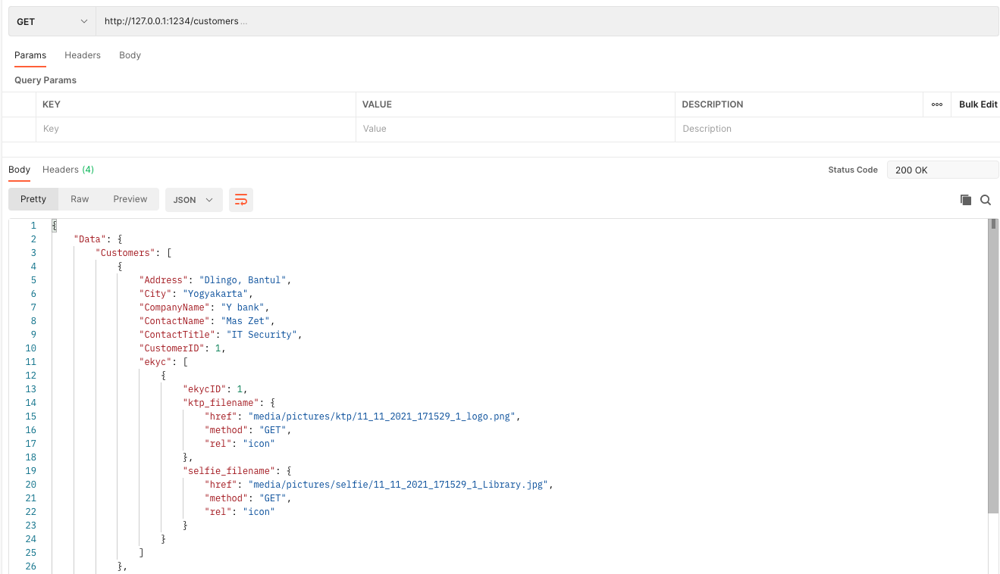

## UTS Web Service


Membuat restful API dengan ketentuan sebagai berikut :
- resource minimal 2 dan saling berelasi ada implementasi HATEOAS pada method GET
contoh (mobil dengan merek, buku dengan pengarang, dll )
- tidak diperkenankan menggunakan database northwind, silahkan usaha sendiri :)
- terdapat method GET seluruh data dan berdasarkan ID, method POST, PUT, dan DELETE
- terdapat response kode error dan keterangannya


Cara menilaikan :
- upload kode anda pada social repository seperti : github, gitlab, atau bitbucket. link repositorynya yang dikirim
- demokan mulai dari GET,POST,PUT, dan DELETE dengan cara merekam dan mengunggah ke youtube. rekaman disertai screen wajah, pada deskripsi video berikan identitas nim dan nama Anda. Selanjutnya link youtube dan link repository kirim ulang ke sini.

Score nilai :
- Upload program : 50
- Mendemokan dengan video di youtube : 50

## Screenshots 
### Create Customer

### Get All Customer

### Get Customer By ID

### Update Customer

### Delete Customer

### Create eKYC

### Update eKYC


## How to run?
```
pip install -r requirements.txt 
python3 api.py
```

## [Postman Collection](https://www.getpostman.com/collections/12306dbf87e6862c1e73)

